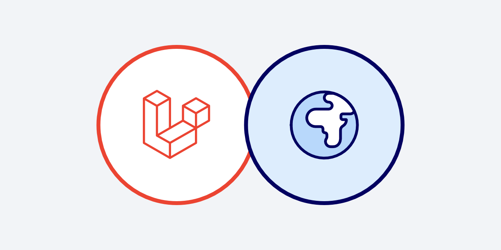

<p align="center"></p>

# Laravel PostGIS

[](https://packagist.org/packages/shabushabu/laravel-postgis)
[](https://packagist.org/packages/shabushabu/laravel-postgis)

Select collection of Laravel query expressions for PostGIS.

## Supported minimum versions

| PHP | Laravel | PostgreSQL | PostGIS |
|-----|---------|------------|---------|
| 8.2 | 11.0    | 16         | 3.4     |

## Installation

> [!CAUTION]
> Please note that this is a new package and, even though it is well tested, it should be considered pre-release software

Before installing the package you should install and enable the [PostGIS](https://postgis.net/documentation/getting_started/) extension.

You can install the package via composer:

```bash
composer require shabushabu/laravel-postgis
```

## Usage

Please see the [expressions folder](src/Expressions) for a full list of supported PostGIS functions.

We do accept pull requests for any additional functions!

The expressions can be used in queries or in migrations.

PostGIS queries often have subtle differences between them, so the way we use this package at ShabuShabu is to extend the Eloquent builder for a given model and use the expressions in there.

### Query examples

#### Getting the GeoJSON representation of a geometry column

```php
use ShabuShabu\PostGIS\Expressions\As;
use Tpetry\QueryExpressions\Language\Alias;
use ShabuShabu\PostGIS\Expressions\Enums\Option;

Track::query()
    ->select(new Alias(new As\GeoJSON('geom', 6, Option::bbox), 'json'))
    ->where('trail_id', 27)
    ->value('json');
```

#### Get a GeoJson Feature collection

```php
use ShabuShabu\PostGIS\Expressions\As;
use Tpetry\QueryExpressions\Language\Alias;
use ShabuShabu\PostGIS\Expressions\Casts\AsJson;
use ShabuShabu\PostGIS\Expressions\Helpers\JsonAgg;
use ShabuShabu\PostGIS\Expressions\Helpers\JsonBuildObject;

DB::query()
    ->select([
        new Alias(new JsonBuildObject([
            'type'     => 'FeatureCollection',
            'features' => new JsonAgg(new AsJson(new As\GeoJson('m.*', null, null)))
        ]), 'features')
    ])
    ->from(
        Track::query()->select(['geom', 'id', 'title']), 't'
    );
```

#### Get an elevation profile from a linestring zm

```php
use Tpetry\QueryExpressions\Language\Alias;
use ShabuShabu\PostGIS\Expressions\Collect;
use ShabuShabu\PostGIS\Expressions\Simplify;
use ShabuShabu\PostGIS\Expressions\DumpPoints;
use ShabuShabu\PostGIS\Expressions\Position\Elevation;
use ShabuShabu\PostGIS\Expressions\Position\Timestamp;

DB::query()->select([
    new Alias(new Elevation('geom'), 'x'),
    new Alias(new Timestamp('geom'), 'y'),
])->from(
    Track::query()->select(
        new Alias(new DumpPoints(new Simplify(new Collect('geom'), 0.15)), 'geom')
    )->where('trail_id', 27), 't'
);
```

#### Get a bounding box for a collection of geometries

```php
use Tpetry\QueryExpressions\Language\Alias;
use ShabuShabu\PostGIS\Expressions\Collect;
use ShabuShabu\PostGIS\Expressions\Envelope;
use ShabuShabu\PostGIS\Expressions\Box\TwoD;
use ShabuShabu\PostGIS\Expressions\Math\Round;
use ShabuShabu\PostGIS\Expressions\Casts\AsJson;
use ShabuShabu\PostGIS\Expressions\Casts\AsNumeric;
use ShabuShabu\PostGIS\Expressions\Helpers\MakeArray;
use ShabuShabu\PostGIS\Expressions\Helpers\ArrayToJson;
use ShabuShabu\PostGIS\Expressions\Position\MinLatitude;
use ShabuShabu\PostGIS\Expressions\Position\MaxLatitude;
use ShabuShabu\PostGIS\Expressions\Position\MinLongitude;
use ShabuShabu\PostGIS\Expressions\Position\MaxLongitude;

DB::query()
    ->select([
        new Alias(new AsJson(new ArrayToJson(new MakeArray([
            new Round(new AsNumeric(new MinLongitude('bbox')), 9),
            new Round(new AsNumeric(new MinLatitude('bbox')), 9),
            new Round(new AsNumeric(new MaxLongitude('bbox')), 9),
            new Round(new AsNumeric(new MaxLatitude('bbox')), 9),
        ]))), 'bbox')
    ])
    ->from(
        Track::query()->select([
            new Alias(new TwoD(new Envelope(new Collect('geom'))), 'bbox')
        ]), 't'
    );
```

### Migration examples

#### Adding a generated column from coordinate columns

```php
use ShabuShabu\PostGIS\Expressions\SetSRID;
use ShabuShabu\PostGIS\Expressions\Position\MakePoint;

Schema::create('locations', static function (Blueprint $table) {
    // all the other table columns...
    
    $table->decimal('lat', 10, 6)->nullable();
    $table->decimal('lng', 10, 6)->nullable();
    $table
        ->geometry('geom', 'point', 4326)
        ->storedAs(new SetSRID(new MakePoint('lng', 'lat'), 4326));
});
```

#### Setting the center for a given multipolygon

```php
use ShabuShabu\PostGIS\Expressions\Centroid;

Schema::create('countries', static function (Blueprint $table) {
    // all the other table columns...
   
    $table->geometry('geom', 'multipolygon', 4326);
    $table
        ->geometry('center', 'point', 4326)
        ->storedAs(new Centroid('geom'));
});
```

#### Setting the area in square kilometers

```php
use ShabuShabu\PostGIS\Expressions\Area;
use Tpetry\QueryExpressions\Value\Value;
use ShabuShabu\PostGIS\Expressions\Math\Round;
use ShabuShabu\PostGIS\Expressions\Casts\AsNumeric;
use ShabuShabu\PostGIS\Expressions\Casts\AsGeography;
use Tpetry\QueryExpressions\Operator\Arithmetic\Divide;

Schema::create('provinces', static function (Blueprint $table) {
    // all the other table columns...
   
    $table->geometry('geom', 'multipolygon', 4326);
    $table
        ->integer('area_km2')
        ->storedAs(new Round(
            new AsNumeric(
                new Divide(
                    new Area(new AsGeography('geom')),
                    new Value(1e+6)
                )
            )
        ));
});
```

### Model Casts

You can cast your geometry columns to their respective `\Brick\Geo\Geometry` counterparts. Here's an example:

```php
use Brick\Geo\Point;
use ShabuShabu\PostGIS\Casts\Geometry;
use Illuminate\Database\Eloquent\Model;

class Location extends Model
{
    // ...
    
    protected function casts(): array
    {
        return [
            'point' => Geometry::using(Point::class),
        ];
    }
}
```

### Brick/Geo Integration

All the necessary wiring to use `brick/geo` with PostGIS is already done for you. You can just resolve `ShabuShabu\PostGIS\Geometry` from the container:

```php
use Brick\Geo\Polygon;
use ShabuShabu\PostGIS\Geometry;

echo app(Geometry::class)->area(
    Polygon::fromText('POLYGON ((0 0, 0 3, 3 3, 0 0))')
);
```

## Testing

```bash
composer test
```

## Changelog

Please see [CHANGELOG](CHANGELOG.md) for more information on what has changed recently.

## Contributing

Please see [CONTRIBUTING](CONTRIBUTING.md) for details.

## Security Vulnerabilities

Please review [our security policy](../../security/policy) on how to report security vulnerabilities.

## Credits

- [Boris Glumpler](https://github.com/boris-glumpler)
- [All Contributors](../../contributors)

## Disclaimer

This is a 3rd party package and ShabuShabu is not affiliated with either Laravel or PostGIS.

## License

The MIT License (MIT). Please see [License File](LICENSE.md) for more information.
